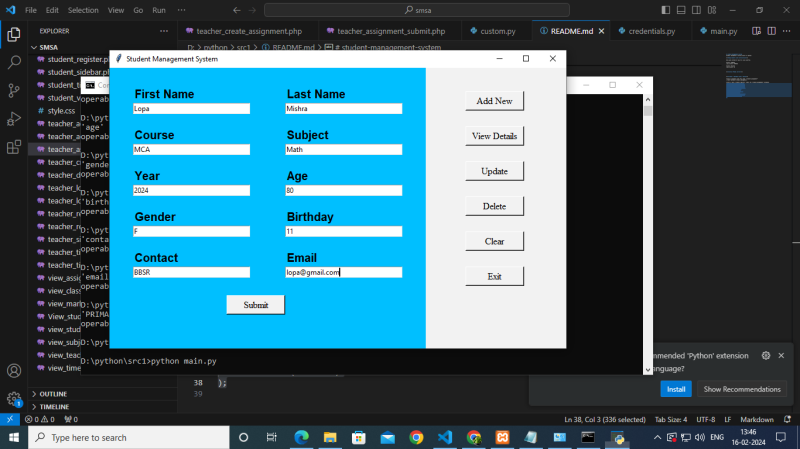

# 👋 Hello, I'm JOHNCLINTON !

🚀 Aspiring *Python Developer* with expertise in * Python,HTML,CSS and ,PHP , and Power *, Django(beginner). 

## 🔧 Technologies & Tools
- 🐍 Python 
- 🗄️ MySQL
- 📊 HTML
- 📈 CSS
- 🔎 PHP

## 💼 Real-Time Projects

### 1. Sign to Audio Conversion System for Hearing Impaired Pepole

The Sign to Audio Conversion System for Hearing Impaired People is a Python-based application developed in PyCharm that translates sign language gestures into audible speech. This system uses image recognition and machine learning algorithms to interpret sign language and convert it into corresponding audio output, bridging the communication gap for hearing-impaired individuals. The project focuses on accessibility, real-time processing, and accuracy to enhance communication for users in various environments.

.jpg)
---

### 2. Student Management (CRUD)

The Student Management (CRUD) project is a web application designed to efficiently manage student data through Create, Read, Update, and Delete (CRUD) operations. 
It features user-friendly interfaces for administrators to add, edit, and remove student records, as well as view detailed student information. 
Built with a focus on performance and data integrity, the platform ensures secure and reliable student management for educational institutions.

---

### 3.The Business Management E-commerce Website

Analyzed housing trends and pricing patterns in Melbourne, showcasing insights through advanced data visualization.

---

The Business Management (E-Commerce Website) project is a full-featured online shopping platform that enables users to browse, search, and purchase products seamlessly.
It offers a secure checkout process, integrated payment gateway, and user account management for a personalized shopping experience. 
The platform is built for scalability and efficiency, with a focus on clean UI/UX design and robust backend operations.

---

## 🎯 What I’m Currently Focusing On:
- 🌱 Learning more about *Machine Learning* and *AI* concepts
- 📚 Exploring advanced data modeling techniques
- 🔄 Contributing to open-source data analytics projects

## 📫 Let’s Connect!
- [LinkedIn]www.linkedin.com/in/john-clinton-7937232b4 
- 📧 Email: vjohnclinton@gmail.com

---

💡 “Turning data into actionable insights is not just a skill; it’s an art of storytelling through numbers.”
